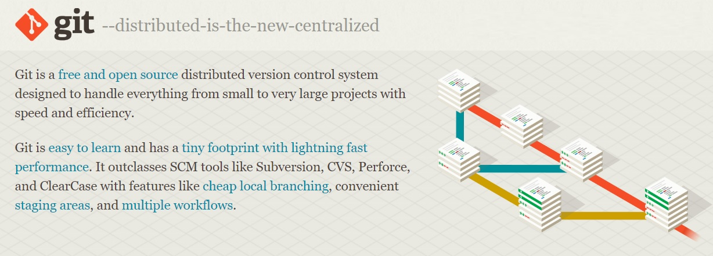

# Инстукция по установке и командам Git

## ***Установка и настройка Git***

Для установки ***Git*** необходимо перейти по ссылке:

[Ссылка на официальный сайт] (https://git-scm.com/download/win)

Желательно скачивать последнюю ( 2.40.0 ) 64-разрядную версию Git для Windows. Это самая последняя поддерживаемая сборка. Он был выпущен около 1 месяца назад, 14 марта 2023 г.

И далее настроить все элементы, следуя инструкции официального сайта:

[Ссылка на официальный сайт] (https://git-scm.com/docs)

## ***Команды Git для терминала***

При первом использовании Git необходимо представиться.  Для этого нужно ввести в терминале 2 команды:

*git config --global user.name «Ваше имя английскими буквами»* 
*git config --global user.email ваша почта@example.com*

* **git init** – инициализация локального репозитория.

* **git status** – получить информацию от git о его текущем состоянии.

* **git add “path”** – добавить файл или файлы к следующему коммиту.

* **git add .** - добавляет все файлы в проекте в отслеживание.

* **git commit -am “message”** - git add + git commit (Работает только после 1-го ручного добавления в отслеживание).

* **git commit -m “message”** – создание коммита.

* **git log** – вывод на экран истории всех коммитов с их хеш-кодами.

* **git checkout** – переход от одного коммита к другому.

* **git checkout master** – вернуться к актуальному состоянию и продолжить работу (git checkout main).

* **git diff** – увидеть разницу между текущим файлом и закоммиченным файлом.

* **git branch** – посмотреть список веток в репозитории.

* **git branch <название ветки>** – создать новую ветку.

* **git checkout <название ветки>** – переход к другой ветке.

* **git branch -d <название ветки>** – удалить ветку.

* **git log –graph** - визуализирует коммиты.

* **git checkout -b <название ветки>** - cоздание и переход в новую ветку.
* **git reset** - используется в основном для отмены изменений. 

* **git rm** - используется в Git для удаления файлов из индекса и рабочей директории. Она похожа на git add с тем лишь исключением, что она удаляет, а не добавляет файлы для следующего коммита.

* **git mv** - всего лишь удобный способ переместить файл, а затем выполнить git add для нового файла и git rm для старого.

* **git clean** - используется для удаления мусора из рабочей директории. Это могут быть результаты сборки проекта или файлы конфликтов слияний.

* **git merge** - используется для слияния одной или нескольких веток в текущую.

* **git stash** - используется для временного сохранения всех незакоммиченных изменений для очистки рабочей директории без необходимости коммитить незавершённую работу в новую ветку.

* **git tag** - используется для задания постоянной метки на какой-либо момент в истории проекта. Обычно она используется для релизов.
